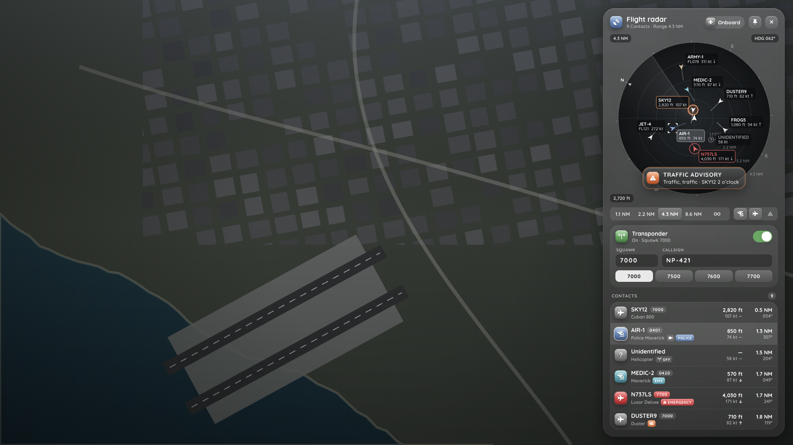
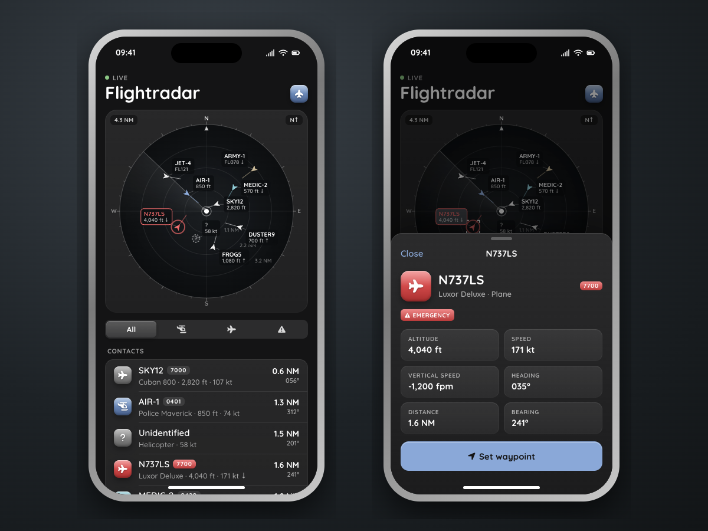

# np_flightradar

A server-authoritative flight radar for FiveM. Pilots see the traffic around them, police and ATC watch the sky from
the ground or from a tower console, and anyone with a scanner item or the phone app can follow air traffic live.
It covers transponders with squawk codes and callsigns, emergency squawks (7500 / 7600 / 7700) that alert the right
jobs, primary radar for aircraft with the transponder off, and TCAS-style traffic and resolution advisories for pilots.
The panel uses the **Nimbus UI** look: frosted glass, glossy squircle tiles and Quicksand type. It follows the server
theme (brand colour, strength, frosted/liquid material) set in np_admin (Settings -> np_admin -> Theme).

Built for **es_extended** + **np_inventory** first. **qbx_core** / **qb-core** and standalone servers work through the
bridge. Every `np_*` sibling is optional.

## Screenshots

| Radar panel | Phone app |
|---|---|
|  |  |

## Features

- **Live contacts**: blips with heading, callsign and per-organisation colours. Aircraft streamed in near you get
  native entity blips. Aircraft further away are dead-reckoned between updates, so their blips move smoothly.
- **No ghost blips**: every update carries the full contact set. Anything missing from it is removed straight away,
  and so are aircraft that despawn without an event.
- **Access modes**: onboard radar (any aircraft seat), ground radar (jobs, grades, duty, Discord roles), handheld
  scanner item, radar stations (towers with unlimited range and primary radar), phone app, and admin. The server
  works out the mode itself; it never trusts the mode a client asks for. Admin and staff access are
  [np_admin](https://github.com/Nico-Pergande/np_admin) permission nodes; no ACE is used anywhere.
- **Transponder**: on/off, 4-digit octal squawk and a callsign, stored in a server-written state bag.
  `/squawk`, `/transponder` and `/callsign` change it, as do the radial menu and the panel.
- **Emergencies**: squawking 7500 / 7600 / 7700 flags the contact (red, flashing). It also notifies the configured
  jobs through np_hud and np_phone and can post to a Discord log channel.
- **Primary radar**: stations and admins still see aircraft with the transponder off, shown as *unidentified*.
- **TCAS-lite**: pilots get a traffic advisory (TA) or resolution advisory (RA, climb / descend) based on the closest
  point of approach. Alerts appear as np_hud toasts, in the panel and as a local event.
- **Panel** (F6) with a range selector, heli/plane/emergency filters, transponder controls, and click-to-set a GPS
  waypoint. Metric or aviation units (ft / kt / fpm / NM).
- **Locales**: English and German.

## Requirements

- A FiveM server with **OneSync** enabled (`set onesync on`). The resource declares `dependency '/onesync'`.
- Optional framework: [es_extended](https://github.com/esx-framework/esx_core),
  [qbx_core](https://github.com/Qbox-project/qbx_core) or [qb-core](https://github.com/qbcore-framework/qb-core).
- No database, no build step and no streamed assets.

## Installation

1. Put the resource in `resources/` as `np_flightradar`.
2. Start it **after** the framework and the optional siblings. Siblings that start later, or restart, are picked up
   automatically.
   ```cfg
   ensure es_extended        # or qbx_core / qb-core
   ensure np_inventory       # optional
   ensure np_hud             # optional
   ensure np_phone           # optional
   ensure np_menu            # optional
   ensure np_identification  # optional
   ensure np_discord         # optional
   ensure np_admin           # optional: permissions, settings, logs, staff tools
   ensure np_flightradar
   ```
3. Give the scanner item to players if you use it. With np_inventory, the `flight_radar` item is registered at
   runtime. With ESX alone, add a `flight_radar` item to your items table; the resource registers it as usable.

## Configuration

Everything is in [`config.lua`](config.lua).

| Option | Default | Description |
|---|---|---|
| `Config.Locale` | `'en'` | `'en'` or `'de'` (game texts and the panel) |
| `Config.Framework` | `'auto'` | `'esx'`, `'qbx'`, `'qb'`, `'standalone'`, or auto-detect (esx → qbx → qb → standalone) |
| `Config.UpdateInterval` | `1000` | ms between radar updates (clamped to 250 to 5000) |
| `Config.Units` | `'aviation'` | `'aviation'` (ft, kt, fpm, NM) or `'metric'` (m, km/h, m/s, km) |
| `Config.Ranges` | `air 6000, ground 12000, item 4000, station 0, phone 8000, admin 0` | Range per mode in metres, `0` = unlimited |
| `Config.RangeSteps` | `{ 2000, 4000, 8000, 16000, 0 }` | Range buttons in the panel, capped at the granted range |
| `Config.Traffic` | `requirePilot = true, requireEngine = false, minSpeed = 0` | What counts as traffic: piloted or engine running, optional minimum speed. `includeParked = true` shows everything |
| `Config.Access.inAircraft` | `true` | Everyone in an aircraft seat gets the onboard radar |
| `Config.Access.jobs` | `police, sheriff, ambulance, atc = 0` | Job → minimum grade for the ground radar |
| `Config.Access.requireDuty` | `true` | Duty is required (qb/qbx duty flag, ESX `job.onDuty` when present) |
| `Config.Access.item` | `'flight_radar'` | Scanner item name (`false` turns it off) |
| `Config.Access.discordRoles` | `{}` | np_discord roles that grant the ground radar |
| `Config.Admin` | `identifiers = {}, groups = { 'admin', 'superadmin' }` | Extra admins **only while np_admin is not running** (identifiers, ESX groups). See [Permissions](#permissions) |
| `Config.Stations` | LSIA, Sandy Shores, McKenzie | `{ label, coords, radius, jobs }`. Standing within `radius` gives the station radar |
| `Config.PrimaryRadar` | `enabled = true, range = 8000` | Stations and admins see transponder-off aircraft as unidentified |
| `Config.Transponder` | `defaultOn = true, defaultSquawk = '7000', copilotCanEdit = true, rate = 1000` | Transponder defaults and the per-player rate limit (ms) |
| `Config.Emergency` | `codes 7500/7600/7700, notifyJobs = { 'police', 'ambulance', 'atc' }, discordChannel = nil` | Who is alerted, and the optional np_discord log channel |
| `Config.Proximity` | `horizontal = 600, vertical = 150, lookahead = 25, sound = true` | TCAS-lite box (m) and look-ahead (s). The RA box is half the TA box |
| `Config.Blips` | heli sprite 64, plane sprite 423, scale 0.8 | Sprites, scale, `lerpMs`, `showForPhone`, and colours per org / emergency / unidentified / unlicensed |
| `Config.Callsigns.perModel` | `{ polmav = 'AIR-1' }` | Fixed callsign per model |
| `Config.Orgs` | `police/sheriff → police, ambulance → ems, fire → fire, army → military` | Pilot job → organisation (blip colour, badge) |
| `Config.Identification` | `checkPilotLicense = true, requireLicenseForAirRadar = false` | np_identification `pilot_license` check |
| `Config.Phone` | `enabled = true, job = nil, item = nil` | Phone app: everyone, or a job (string or list) |
| `Config.Keys` / `Config.Commands` | `panel = 'F6'` / `radar, squawk, transponder, callsign` | Key and command names |
| `Config.Integrations` | all `true` | Set a sibling to `false` to ignore it even when it is running |
| `Config.CanUse` | `nil` | `function(src, mode) -> bool`. A server-side veto hook |

Callsigns are resolved in this order: the pilot's transponder callsign, then np_manufacturing's `vehicleCallsign`,
then `Config.Callsigns.perModel`, then the pilot's framework callsign (qb `metadata.callsign`), then the plate.

## Permissions

Permissions are managed in [np_admin](https://github.com/Nico-Pergande/np_admin). np_flightradar registers two
nodes, which show up in np_admin's permission editor under *Flight radar*:

| Node | Grants |
|---|---|
| `np_flightradar.admin` | Admin radar: every aircraft, unlimited range (`Config.Ranges.admin`), primary radar. Also the staff tools below |
| `np_flightradar.ground` | Ground radar without one of the `Config.Access.jobs` (staff, standalone servers). Range `Config.Ranges.ground` |

When a player's groups change in np_admin, their radar access is re-resolved at once.

np_admin is optional and never a hard dependency; the integration lib is vendored as `bridge/np_admin.lua`. Without
np_admin running, a node is granted to:

1. the server console;
2. identifiers in the convar `np_admin_fallback`, e.g. `set np_admin_fallback "license:abc,discord:123"`;
3. on ESX, the groups in the convar `np_admin_fallback_groups` (default `admin,superadmin`);
4. the identifiers and ESX groups in `Config.Admin`.

Everyone else is refused. No ACE is used: there are no `add_ace` lines to set up.

### np_admin (optional)

With np_admin running you also get:

- **Settings** (`shared/np_admin_settings.lua`): 40 options under *Flight radar*, in the categories General, Ranges,
  Traffic, Access, Transponder, Emergencies, TCAS and Blips. They cover the language, units and update interval, the range per
  mode and the panel range steps, the traffic filter, the access rules (onboard radar, ground radar jobs, duty, Discord
  roles, pilot licence, primary radar), transponder defaults, emergency jobs and the Discord channel, the TCAS-lite box
  and the blip sizes and colours. Everything applies live except `Framework`, which needs a restart. Access changes
  re-resolve every player at once. Stations (coordinates), `Config.CanUse`, `Config.Admin`, commands and key, item,
  phone, callsigns, orgs, emergency codes and the integration switches stay in `config.lua`.
- **Logs**: every emergency squawk (7500 / 7600 / 7700) is written to the np_admin log (category `np_flightradar`).
  The np_discord log channel keeps working as before.
- **Staff tools** under *Resource tools* (node `np_flightradar.admin`): *Open admin flight radar*, and *Set
  transponder* for a player's aircraft (squawk, callsign, power).

## Commands and keys

| Command | Key | Description |
|---|---|---|
| `/radar` | `F6` | First press opens the panel. In a vehicle the panel opens without the mouse, and a second press gives mouse focus. Pressing again closes it |
| `/squawk <code>` | | Set the squawk (4 digits, 0-7). Pilot, or copilot if allowed |
| `/transponder [on\|off]` | | Switch the transponder on or off (no argument toggles) |
| `/callsign [text]` | | Set the transponder callsign (A-Z, 0-9, -, max. 8). Empty resets it |

Players can rebind the key under *Settings → Key Bindings → FiveM*.

## Integrations

All integrations are optional, detected at runtime and wrapped in `pcall`. Each one is re-wired when the sibling
restarts and can be switched off in `Config.Integrations`.

| Resource | What it adds | Without it |
|---|---|---|
| es_extended / qbx_core / qb-core | Jobs, grades, duty, admin groups, framework callsigns, usable item | Standalone: air and phone modes, admins by identifier, item mode with np_inventory |
| np_hud | Toasts (TCAS, emergencies, feedback) and the top-right zone claim while the panel is open | ox_lib notify, then the native feed |
| np_phone | **Flightradar** store app (`html/phone.html`) with live traffic, plus emergency push notifications | No phone app |
| np_inventory | Registers the `flight_radar` scanner item (client export `np_flightradar.useScanner`) and checks item counts | Framework usable item and item count |
| np_identification | Flags pilots without a valid `pilot_license` as *unlicensed*. Can also require the licence for the onboard radar | No licence flag |
| np_discord | Ground-radar access by Discord role (cached, refreshed every 10 min), and an emergency log channel | Jobs and admins only |
| np_admin | Permission nodes, 40 live settings, emergency log and staff tools (see [Permissions](#permissions)) | Fallback convars and `Config.Admin`; config.lua only |
| np_menu | Radial **Flight radar** entry, and a **Transponder** submenu in aircraft (on/off, 7000/7500/7600/7700, callsign dialog) | Commands and key only |
| np_manufacturing | Callsigns from the `vehicleCallsign` state bag | perModel / pilot callsign / plate |
| np_helicam | *Camera active* flag from the `helicam_cam` state bag | No camera flag |

## API

### Server exports

```lua
exports.np_flightradar:GetAircraft()             -- { { netId, entity, kind, model, plate, callsign, squawk, transponder,
                                                 --     emergency, coords, heading, speed, pilot } ... }
exports.np_flightradar:GetAircraftByNetId(netId) -- same shape or nil
exports.np_flightradar:SetTransponder(netIdOrEntity, { on = true, squawk = '7700', callsign = 'AIR-1' }) -- state | nil, err
exports.np_flightradar:GetSubscribers()          -- { { source, mode, range, primary } ... }
exports.np_flightradar:RegisterAccessCheck(function(src, mode) return mode ~= 'admin' end) -- false denies
```

### Server events (local)

```lua
AddEventHandler('np_flightradar:aircraftAdded', function(netId, kind) end)
AddEventHandler('np_flightradar:aircraftRemoved', function(netId) end)
AddEventHandler('np_flightradar:emergency', function(netId, squawk, info) end) -- info = { callsign, kind, reason, by, coords }
```

### Client exports

```lua
exports.np_flightradar:OpenRadar(mode?)   -- nil = best granted mode, or 'item' / 'ground' / ...
exports.np_flightradar:CloseRadar()
exports.np_flightradar:IsRadarOpen()      -- bool
exports.np_flightradar:GetContacts()      -- latest contacts (NUI contact shape)
exports.np_flightradar:GetTransponder()   -- { on, squawk, callsign, canEdit } | nil
exports.np_flightradar:SetSquawk('7000')  -- bool (request sent)
exports.np_flightradar:useScanner(data, slot) -- np_inventory item use
```

### Client events (local)

```lua
AddEventHandler('np_flightradar:contactsUpdated', function(contacts) end)  -- after every update
AddEventHandler('np_flightradar:proximity', function(level, netId) end)    -- 'TA' | 'RA' | 'clear'
```

### State bags

| Bag | On | Written by | Value |
|---|---|---|---|
| `np_fr_xpdr` | aircraft entity | this resource (server only) | `{ on, squawk, callsign }` |
| `vehicleCallsign` | aircraft entity | np_manufacturing (read) | string |
| `helicam_cam` | aircraft entity | np_helicam (read) | `{ on = bool, ... }` |

### Network protocol

- `np_flightradar:subscribe (mode, reqId)` / `np_flightradar:unsubscribe`: client → server. Rate-limited, and bursts
  are coalesced. The reply is `np_flightradar:subscribed { mode, range, primary, reqId }` or `np_flightradar:denied`.
  When a periodic re-check changes the grant (seat, tower, job), the server sends `subscribed` again with the same
  `reqId` and `update = true`; a lost grant is `np_flightradar:revoked (reason)`.
- `np_flightradar:contacts { t, c = { { id, x, y, z, h, s, vs } } }`: integers only. `h` is the GTA heading,
  `s` / `vs` are m/s × 10. This is the **full** set every tick.
- `np_flightradar:meta { [netId] = { kind, model, callsign, squawk, org, flags } }`: sent only when an aircraft is
  new or has changed for that subscriber.
- `np_flightradar:setTransponder { on?, squawk?, callsign? }`: the server checks the driver seat (or seat 0) of a
  registered aircraft, validates and sanitises the values, and rate-limits per player.

### NUI locale keys

The panel and the phone app get the merged locale table as `open.locale`. These are the panel keys (English):

`title, contacts, range, range_unlimited, filters, filter_heli, filter_plane, filter_emergency, transponder, squawk,
callsign, on, off, apply, close, focus, no_contacts, unidentified, unlicensed, camera, xpdr_off, emergency, kind_heli,
kind_plane, model, altitude, speed, heading, vertical_speed, distance, bearing, set_waypoint, waypoint_set, sq_7500,
sq_7600, sq_7700, org_police, org_ems, org_fire, org_military, ta, ra, ta_title, ra_title, ta_text, ra_climb,
ra_descend, ra_turn, clear_text, mode_air, mode_ground, mode_station, mode_item, mode_phone, mode_admin, unit_ft,
unit_kt, unit_fpm, unit_nm, unit_m, unit_kmh, unit_ms, unit_km, squawk_hint, callsign_hint`

Headings and bearings sent to the NUI are **compass** degrees (0 = north, clockwise). Distances are metres and speeds
are m/s.

## Performance

- **Nothing runs while nobody is subscribed.** The broadcast thread exists only while there is at least one
  subscriber. Seat detection is event-driven (`CEventNetworkPlayerEnteredVehicle`) and only watches the seat at 1 Hz
  while you sit in an aircraft.
- The registry is kept current by `entityCreated` / `entityRemoved`. `GetAllVehicles` runs only at start and in a
  30 s safety re-sync.
- Each tick builds one snapshot (O(aircraft)), then filters it per subscriber (O(aircraft) each). Static data
  (callsign, model, flags) is diffed per subscriber, so the hot payload is a handful of integers per contact.
- Access is cached per player for 30 s and dropped on job, duty or load events. Pilot licences are cached for 60 s
  and refreshed off-thread. Discord roles are cached and refreshed in a thread, because `HasAnyRole` yields.
- The client runs at most one blip lerp thread (only while coord blips exist), pushes NUI updates at most at 2 Hz and
  only while the panel is open, and runs the TCAS check at 2 Hz only while you are the pilot.

## Development

```sh
tests/run.sh
```

This runs `luac -p` on every Lua file, followed by the unit tests for `shared/radarmath.lua` and `shared/access.lua`.
It also runs server and client smoke tests against stubbed natives (`tests/harness.lua`): registry add/remove, no
ghosts, range filter, own vehicle excluded, primary radar, transponder seat checks, rate limits, emergencies, an idle
loop without subscribers, and the client blip/panel/TCAS flow. `tests/test_np_admin.lua` covers the np_admin
integration against a fake np_admin: `npAdmin.can` delegation and the fallback, node / settings / action
registration, the settings schema, live settings and the emergency log. It needs Lua 5.4 (`lua`, `luac`).

To work on the UI in a browser without the game, open `html/index.html?dev=1`. This mock mode feeds simulated traffic.

## Credits and license

The original v0 resource was written by **Nico-Pergande**. Licensed under **GPL-3.0**, see [LICENSE](LICENSE).
